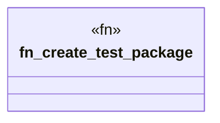

# `crates/ggen-cli/tests/marketplace/registry_tests.rs`

Source SHA-256: `4ff21278f20a1c607701e35a5b54c640147d9775c4353a800c68dba8f0f1da76`

## Dependencies

- `chrono`
- `ggen_cli_lib::domain::marketplace::registry::*`
- `ggen_core::utils::error::Result`
- `std::collections::HashMap`
- `std::path::Path`
- `tempfile::TempDir`
- `tokio::fs`
- `tokio::io::AsyncWriteExt`

## Standing

- Structural parse: `ALIVE`
- Runtime behavior: `UNKNOWN`
