# `crates/ggen-cli/tests/marketplace/security/consolidated_security.rs`

Source SHA-256: `adee43f66f399ded7ae1cef37ffb800deaa89b44f3c398d0f9ba1fbee6e01156`

```mermaid
classDiagram
    class mod_ed25519_security_tests {
      <<mod>>
    }
    class fn_test_package_id_validation {
      <<fn>>
    }
    class fn_test_package_id_sanitization {
      <<fn>>
    }
    class fn_test_score_validation_prevents_overflow {
      <<fn>>
    }
    class fn_test_negative_values_handled_safely {
      <<fn>>
    }
    class fn_test_extreme_values_handling {
      <<fn>>
    }
    class fn_test_whitespace_handling_in_names {
      <<fn>>
    }
    class fn_test_unicode_handling {
      <<fn>>
    }
    class fn_test_empty_string_handling {
      <<fn>>
    }
    class fn_test_very_long_strings {
      <<fn>>
    }
    class fn_test_null_byte_handling {
      <<fn>>
    }
    class fn_test_score_consistency {
      <<fn>>
    }
    class fn_test_dimension_score_validation {
      <<fn>>
    }
```

## Dependencies

- `ggen_core::marketplace::prelude::*`
- `ggen_marketplace_v2::security::SignatureManager`

## Standing

- Structural parse: `ALIVE`
- Runtime behavior: `UNKNOWN`
