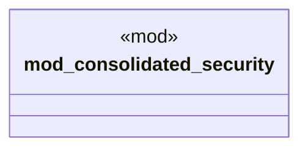

# `crates/ggen-cli/tests/marketplace/security/mod.rs`

Source SHA-256: `95b39956bc46f6fc0baddd7efd4530e3552f263b8b85c4d8fb6f7b607c5286c7`

## Dependencies

- None observed.

## Standing

- Structural parse: `ALIVE`
- Runtime behavior: `UNKNOWN`
