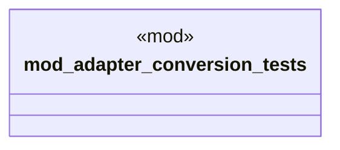

# `crates/ggen-cli/tests/marketplace/unit/adapter_conversion_test.rs`

Source SHA-256: `73b5195b3f71deb20a52df13d077a193e1488e088fe8f18181dcea650fcea804`

## Dependencies

- `chrono::Utc`
- `ggen_core::marketplace::Package as V1Package`
- `ggen_core::marketplace::{MaturityLevel, PackageMetadata}`
- `ggen_marketplace_v2::models::PackageMetadata as V2Metadata`
- `ggen_marketplace_v2::models::{Package as V2Package, PackageId, PackageVersion}`
- `std::time::Instant`

## Standing

- Structural parse: `ALIVE`
- Runtime behavior: `UNKNOWN`
