# `crates/ggen-cli/tests/marketplace/unit/maturity_scoring_test.rs`

Source SHA-256: `02b99e075998f8b90bb2abcca6210d0a5752bdc1fd578704ac024325841bc4d9`

```mermaid
classDiagram
    class fn_test_documentation_dimension_full_score {
      <<fn>>
    }
    class fn_test_documentation_dimension_partial_score {
      <<fn>>
    }
    class fn_test_testing_dimension_high_coverage {
      <<fn>>
    }
    class fn_test_testing_dimension_medium_coverage {
      <<fn>>
    }
    class fn_test_security_dimension_no_vulnerabilities {
      <<fn>>
    }
    class fn_test_security_dimension_with_vulnerabilities {
      <<fn>>
    }
    class fn_test_maturity_level_thresholds {
      <<fn>>
    }
    class fn_test_total_score_calculation {
      <<fn>>
    }
    class fn_test_score_breakdown_percentages {
      <<fn>>
    }
    class fn_test_extreme_values {
      <<fn>>
    }
    class fn_test_maturity_level_descriptions {
      <<fn>>
    }
    class fn_test_maturity_level_recommendations {
      <<fn>>
    }
    class fn_test_maturity_dashboard_statistics {
      <<fn>>
    }
```

## Dependencies

- `ggen_core::marketplace::prelude::*`

## Standing

- Structural parse: `ALIVE`
- Runtime behavior: `UNKNOWN`
