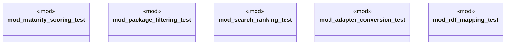

# `crates/ggen-cli/tests/marketplace/unit/mod.rs`

Source SHA-256: `2d7e2c0a0496387931b6d53ef638eafa3eff5c28559e0dacefc7f08e56afecfb`

## Dependencies

- None observed.

## Standing

- Structural parse: `ALIVE`
- Runtime behavior: `UNKNOWN`
