# `crates/ggen-cli/tests/marketplace/unit/package_filtering_test.rs`

Source SHA-256: `eafe31f2de9298b7efa367d98cb9d3aab779ec4b8f9ce475ad6f879425495044`

```mermaid
classDiagram
    class fn_test_filter_by_maturity_level_production {
      <<fn>>
    }
    class fn_test_filter_by_maturity_level_beta {
      <<fn>>
    }
    class fn_test_filter_by_maturity_level_experimental {
      <<fn>>
    }
    class fn_test_filter_by_score_range {
      <<fn>>
    }
    class fn_test_filter_by_score_minimum_only {
      <<fn>>
    }
    class fn_test_filter_by_score_exact_range {
      <<fn>>
    }
    class fn_test_filter_by_dimension_documentation {
      <<fn>>
    }
    class fn_test_filter_by_dimension_testing {
      <<fn>>
    }
    class fn_test_filter_by_dimension_security {
      <<fn>>
    }
    class fn_test_filter_by_multiple_dimensions {
      <<fn>>
    }
    class fn_test_filter_by_all_dimensions_high_bar {
      <<fn>>
    }
    class fn_test_filter_empty_result_high_threshold {
      <<fn>>
    }
    class fn_test_filter_by_use_case_production {
      <<fn>>
    }
    class fn_test_filter_by_use_case_research {
      <<fn>>
    }
    class fn_test_filter_by_use_case_enterprise {
      <<fn>>
    }
    class fn_test_filter_by_use_case_startup {
      <<fn>>
    }
    class fn_test_filter_combination_level_and_dimension {
      <<fn>>
    }
    class fn_test_filter_preserves_order {
      <<fn>>
    }
    class fn_test_filter_no_mutation {
      <<fn>>
    }
```

## Dependencies

- `ggen_core::marketplace::prelude::*`

## Standing

- Structural parse: `ALIVE`
- Runtime behavior: `UNKNOWN`
