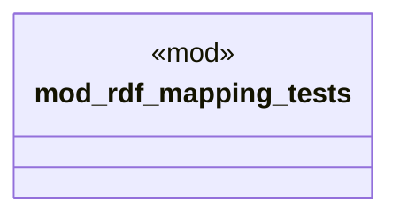

# `crates/ggen-cli/tests/marketplace/unit/rdf_mapping_test.rs`

Source SHA-256: `9a03c1d56484a7eeb71ad1f34451057a54a55fe7f0de3ac182984f06d65d801c`

## Dependencies

- `chrono::Utc`
- `ggen_marketplace_v2::models::{Package, PackageId, PackageMetadata, PackageVersion}`
- `ggen_marketplace_v2::ontology::MARKETPLACE_ONTOLOGY`
- `std::time::Instant`

## Standing

- Structural parse: `ALIVE`
- Runtime behavior: `UNKNOWN`
