# `crates/ggen-cli/tests/marketplace/unit/search_ranking_test.rs`

Source SHA-256: `14dc0adbcd8329d1024a5a3c8935a32605e6be935aba69d3492a809fa49f60a3`

```mermaid
classDiagram
    class fn_create_test_package {
      <<fn>>
    }
    class fn_test_default_scorer_weights {
      <<fn>>
    }
    class fn_test_custom_scorer_weights {
      <<fn>>
    }
    class fn_test_popularity_scoring_logarithmic_scale {
      <<fn>>
    }
    class fn_test_quality_scoring_normalized {
      <<fn>>
    }
    class fn_test_recency_scoring_time_decay {
      <<fn>>
    }
    class fn_test_relevance_weight_dominates {
      <<fn>>
    }
    class fn_test_zero_downloads_handling {
      <<fn>>
    }
    class fn_test_perfect_package_score {
      <<fn>>
    }
    class fn_test_poor_package_score {
      <<fn>>
    }
    class fn_test_score_consistency {
      <<fn>>
    }
    class fn_test_weight_sum_validation {
      <<fn>>
    }
    class fn_test_extreme_downloads {
      <<fn>>
    }
    class fn_test_negative_days_handling {
      <<fn>>
    }
    class fn_test_ranking_order {
      <<fn>>
    }
```

## Dependencies

- `chrono::{Duration, Utc}`
- `ggen_core::marketplace::search::scoring::CustomScorer`
- `ggen_core::marketplace::types::Package`

## Standing

- Structural parse: `ALIVE`
- Runtime behavior: `UNKNOWN`
