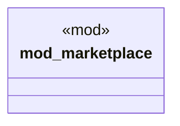

# `crates/ggen-cli/tests/marketplace_comprehensive.rs`

Source SHA-256: `5a8d50e4c5329384cdd28ef702b88a6459e7f94aeabcbed96aa9294450144a18`

## Dependencies

- `marketplace::*`

## Standing

- Structural parse: `ALIVE`
- Runtime behavior: `UNKNOWN`
