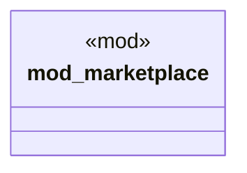

# `crates/ggen-cli/tests/marketplace_registry_test.rs`

Source SHA-256: `24424f46ed2ecf3d6668ea505b8c561506bddbc8edb76f1f4c745d2cd42828e9`

## Dependencies

- None observed.

## Standing

- Structural parse: `ALIVE`
- Runtime behavior: `UNKNOWN`
