# `crates/ggen-cli/tests/marketplace_sync_e2e.rs`

Source SHA-256: `77d8452d391ba080050cd187a1fe6582d3957e7169afabfa83992985867fc5c5`

```mermaid
classDiagram
    class fn_ggen {
      <<fn>>
    }
    class fn_create_test_marketplace_cache {
      <<fn>>
    }
    class fn_test_marketplace_sync_basic {
      <<fn>>
    }
    class fn_test_marketplace_sync_with_force {
      <<fn>>
    }
    class fn_test_marketplace_sync_with_dry_run {
      <<fn>>
    }
    class fn_test_marketplace_sync_with_verbose {
      <<fn>>
    }
    class fn_test_marketplace_sync_with_custom_source {
      <<fn>>
    }
    class fn_test_marketplace_sync_idempotent {
      <<fn>>
    }
    class fn_test_marketplace_sync_output_json_compatible {
      <<fn>>
    }
    class fn_test_marketplace_sync_cache_location_override {
      <<fn>>
    }
    class fn_test_marketplace_sync_combined_flags {
      <<fn>>
    }
```

## Dependencies

- `assert_cmd::Command`
- `predicates::prelude::*`
- `std::fs`
- `tempfile::TempDir`

## Standing

- Structural parse: `ALIVE`
- Runtime behavior: `UNKNOWN`
