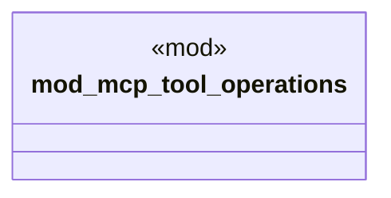

# `crates/ggen-cli/tests/mcp_tool_operations.rs`

Source SHA-256: `ee41d9073fcccf8936b5678f214fe62d2711f61951491ac12c7aa9b0dadd406c`

## Dependencies

- `serde_json::{json, Value as JsonValue}`
- `std::collections::HashMap`
- `std::sync::Arc`
- `tokio::sync::RwLock`

## Standing

- Structural parse: `ALIVE`
- Runtime behavior: `UNKNOWN`
