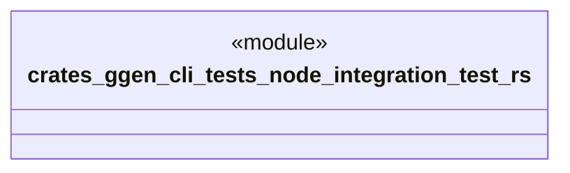

# `crates/ggen-cli/tests/node_integration_test.rs`

Source SHA-256: `7c018f34bf8b4e8a7358340de038fdb8dd5192dddfc4aae3356ace0c3e79ccd3`

## Dependencies

- `ggen_cli_lib::run_for_node`

## Standing

- Structural parse: `ALIVE`
- Runtime behavior: `UNKNOWN`
