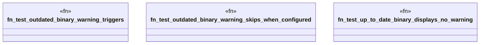

# `crates/ggen-cli/tests/outdated_warning_tests.rs`

Source SHA-256: `1f910f9b07e41fff9225961e8ab3528f05b636fec07f9f0a0e4e92dbd8135158`

## Dependencies

- `std::fs`
- `std::process::Command`
- `std::time::{Duration, SystemTime}`
- `tempfile::TempDir`

## Standing

- Structural parse: `ALIVE`
- Runtime behavior: `UNKNOWN`
