# `crates/ggen-cli/tests/packs/integration/complete_workflow_test.rs`

Source SHA-256: `377a1e6738532ab088fa9968b1fc5949cb15f939db7f50c684f1b1b83be72b67`

```mermaid
classDiagram
    class struct_PackRegistry {
      <<struct>>
    }
    class struct_PackInstaller {
      <<struct>>
    }
    class struct_PackVerifier {
      <<struct>>
    }
    class struct_PackMetadata {
      <<struct>>
      +"id: String"
      +"version: String"
      +"dependencies: Vec~String~"
    }
    class fn_test_complete_installation_workflow {
      <<fn>>
    }
    class fn_test_multi_pack_installation_with_dependencies {
      <<fn>>
    }
    class fn_test_installation_failure_recovery {
      <<fn>>
    }
    class fn_test_fmea_complete_installation_pipeline {
      <<fn>>
    }
    note "PackInstaller"
    note "PackRegistry"
    note "PackVerifier"
```

## Dependencies

- None observed.

## Standing

- Structural parse: `ALIVE`
- Runtime behavior: `UNKNOWN`
