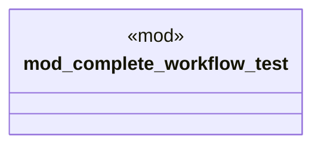

# `crates/ggen-cli/tests/packs/integration/mod.rs`

Source SHA-256: `6d4973ba41fef8440d6342994db7999792ec5b504a87b768b02cea6d24781c11`

## Dependencies

- None observed.

## Standing

- Structural parse: `ALIVE`
- Runtime behavior: `UNKNOWN`
