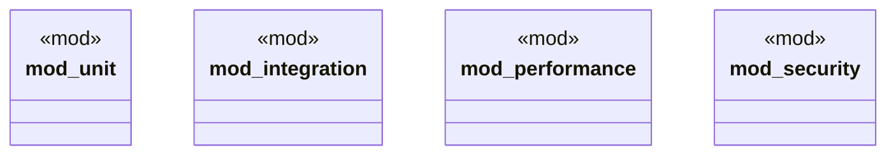

# `crates/ggen-cli/tests/packs/mod.rs`

Source SHA-256: `a8b7fed952706e7dc316e64b3066188d528ff9645fabc34d520499004135a8ab`

## Dependencies

- `unit::installation::*`

## Standing

- Structural parse: `ALIVE`
- Runtime behavior: `UNKNOWN`
