# `crates/ggen-cli/tests/packs/performance/benchmarks.rs`

Source SHA-256: `b362b072ff28ad8d1a12ea3edf28ac74c537c065f281ac40937fcffad23b86c8`

```mermaid
classDiagram
    class fn_benchmark_installation_speed {
      <<fn>>
    }
    class fn_benchmark_dependency_resolution {
      <<fn>>
    }
    class fn_benchmark_sparql_query_performance {
      <<fn>>
    }
    class fn_benchmark_template_generation {
      <<fn>>
    }
    class fn_benchmark_cache_hit_performance {
      <<fn>>
    }
    class fn_benchmark_memory_usage {
      <<fn>>
    }
    class fn_test_scale_100_packages {
      <<fn>>
    }
    class fn_test_scale_1000_packages {
      <<fn>>
    }
```

## Dependencies

- `std::time::Instant`

## Standing

- Structural parse: `ALIVE`
- Runtime behavior: `UNKNOWN`
