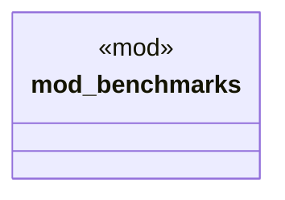

# `crates/ggen-cli/tests/packs/performance/mod.rs`

Source SHA-256: `fda57f2c83dd25f7d424e1d603580f7e9d9d089a5136ade757d61500103b3e56`

## Dependencies

- None observed.

## Standing

- Structural parse: `ALIVE`
- Runtime behavior: `UNKNOWN`
