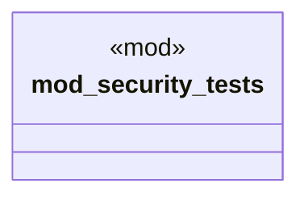

# `crates/ggen-cli/tests/packs/security/mod.rs`

Source SHA-256: `5d87b1022b2ee94a4ac5f2f1aafac24124a6aed986f618c7fd336356a413e701`

## Dependencies

- None observed.

## Standing

- Structural parse: `ALIVE`
- Runtime behavior: `UNKNOWN`
