# `crates/ggen-cli/tests/packs/security/security_tests.rs`

Source SHA-256: `31277d52e4777355c1f603e9a4dc8e8f6480d62ac5bb443a2e59056d85594309`

```mermaid
classDiagram
    class fn_test_reject_unsigned_packages {
      <<fn>>
    }
    class fn_test_reject_invalid_signatures {
      <<fn>>
    }
    class fn_test_require_trusted_keys {
      <<fn>>
    }
    class fn_test_block_parent_directory_access {
      <<fn>>
    }
    class fn_test_block_absolute_paths {
      <<fn>>
    }
    class fn_test_block_symlink_attacks {
      <<fn>>
    }
    class fn_test_block_command_injection {
      <<fn>>
    }
    class fn_test_block_sql_injection {
      <<fn>>
    }
    class fn_test_run_with_minimal_privileges {
      <<fn>>
    }
    class fn_test_no_setuid_files {
      <<fn>>
    }
    class fn_test_fmea_malicious_package_rejection {
      <<fn>>
    }
```

## Dependencies

- None observed.

## Standing

- Structural parse: `ALIVE`
- Runtime behavior: `UNKNOWN`
