# `crates/ggen-cli/tests/packs/unit/installation/dependency_order_test.rs`

Source SHA-256: `0e8548ef044d906d35d10e2185c47b4e88461f4f214b3df74b28e9bb1c0a595d`

```mermaid
classDiagram
    class enum_DependencyError {
      <<enum>>
    }
    class struct_DependencyResolver {
      <<struct>>
      +"graph: HashMap~String"
    }
    class fn_test_simple_dependency_chain {
      <<fn>>
    }
    class fn_test_no_dependencies {
      <<fn>>
    }
    class fn_test_diamond_dependency {
      <<fn>>
    }
    class fn_test_simple_cycle_detection {
      <<fn>>
    }
    class fn_test_self_dependency {
      <<fn>>
    }
    class fn_test_complex_cycle_detection {
      <<fn>>
    }
    class fn_test_large_dependency_graph {
      <<fn>>
    }
    class fn_test_multiple_root_packages {
      <<fn>>
    }
    class fn_test_empty_graph {
      <<fn>>
    }
    class fn_test_single_package {
      <<fn>>
    }
    class fn_test_fmea_circular_dependency_detection {
      <<fn>>
    }
    class fn_test_fmea_missing_dependency_detection {
      <<fn>>
    }
    class fn_test_fmea_installation_order_correctness {
      <<fn>>
    }
    note "DependencyResolver"
    note "std::error::Error for DependencyError"
    note "std::fmt::Display for DependencyError"
```

## Dependencies

- `std::collections::{HashMap, HashSet, VecDeque}`

## Standing

- Structural parse: `ALIVE`
- Runtime behavior: `UNKNOWN`
