# `crates/ggen-cli/tests/packs/unit/installation/download_test.rs`

Source SHA-256: `bef1649e392228b3ce1c22cb3071aa820cf86485d2fefd01f05cc07cad71b930`

```mermaid
classDiagram
    class enum_DownloadError {
      <<enum>>
    }
    class struct_PackageDownloader {
      <<struct>>
      +"client: ReqwestClient"
      +"max_retries: usize"
      +"timeout: Duration"
    }
    class fn_test_download_success {
      <<fn>>
    }
    class fn_test_download_network_timeout {
      <<fn>>
    }
    class fn_test_download_retry_succeeds_on_second_attempt {
      <<fn>>
    }
    class fn_test_checksum_verification_success {
      <<fn>>
    }
    class fn_test_checksum_verification_failure {
      <<fn>>
    }
    class fn_test_empty_download {
      <<fn>>
    }
    class fn_test_large_download {
      <<fn>>
    }
    class fn_test_invalid_url {
      <<fn>>
    }
    class fn_test_connection_refused {
      <<fn>>
    }
    class fn_test_fmea_corrupted_package_detection_and_retry {
      <<fn>>
    }
    class fn_test_fmea_network_timeout_retry_mechanism {
      <<fn>>
    }
    class fn_test_fmea_partial_download_recovery {
      <<fn>>
    }
    note "From~reqwest::Error~ for DownloadError"
    note "PackageDownloader"
    note "std::error::Error for DownloadError"
    note "std::fmt::Display for DownloadError"
```

## Dependencies

- `httpmock::prelude::*`
- `reqwest::Client as ReqwestClient`
- `sha2::{Digest, Sha256}`
- `std::time::Duration`
- `tokio::runtime::Runtime`

## Standing

- Structural parse: `ALIVE`
- Runtime behavior: `UNKNOWN`
