# `crates/ggen-cli/tests/packs/unit/installation/extraction_test.rs`

Source SHA-256: `abd880b9ccad02cb57c86b471087fdcc1552a95240e0e96a6ccf2f289257f469`

```mermaid
classDiagram
    class struct_PackageExtractor {
      <<struct>>
      +"target_dir: PathBuf"
    }
    class enum_ExtractionError {
      <<enum>>
    }
    class fn_create_test_archive {
      <<fn>>
    }
    class fn_create_malicious_archive_with_path_traversal {
      <<fn>>
    }
    class fn_test_extract_simple_archive {
      <<fn>>
    }
    class fn_test_extract_creates_directories {
      <<fn>>
    }
    class fn_test_verify_extraction_success {
      <<fn>>
    }
    class fn_test_verify_extraction_missing_file {
      <<fn>>
    }
    class fn_test_path_traversal_prevention {
      <<fn>>
    }
    class fn_test_is_path_traversal_detection {
      <<fn>>
    }
    class fn_test_invalid_archive_format {
      <<fn>>
    }
    class fn_test_empty_archive {
      <<fn>>
    }
    class fn_test_large_archive_extraction {
      <<fn>>
    }
    class fn_test_fmea_extraction_failure_detection {
      <<fn>>
    }
    class fn_test_fmea_disk_full_handling {
      <<fn>>
    }
    class fn_test_fmea_path_traversal_attack_prevention {
      <<fn>>
    }
    note "PackageExtractor"
    note "std::error::Error for ExtractionError"
    note "std::fmt::Display for ExtractionError"
```

## Dependencies

- `flate2::Compression`
- `flate2::write::GzEncoder`
- `std::fs`
- `std::io::Write`
- `std::path::{Path, PathBuf}`
- `tempfile::TempDir`

## Standing

- Structural parse: `ALIVE`
- Runtime behavior: `UNKNOWN`
