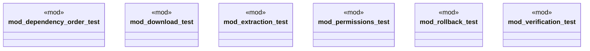

# `crates/ggen-cli/tests/packs/unit/installation/mod.rs`

Source SHA-256: `3b986b8223baaddeddf70a8e3c42630456c35a4021645e9559f3f2e787e2fed7`

## Dependencies

- None observed.

## Standing

- Structural parse: `ALIVE`
- Runtime behavior: `UNKNOWN`
