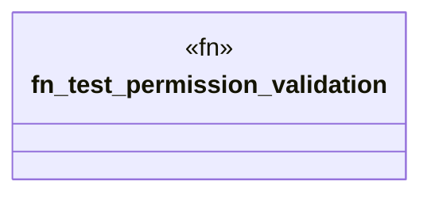

# `crates/ggen-cli/tests/packs/unit/installation/permissions_test.rs`

Source SHA-256: `aafc64718e1720fe492d949cf1f6d02b6a01074307c322048e1d9d5b34d3e842`

## Dependencies

- `ggen_cli_lib::validation_lib::security::{Permission, PermissionModel}`
- `std::path::Path`

## Standing

- Structural parse: `ALIVE`
- Runtime behavior: `UNKNOWN`
