# `crates/ggen-cli/tests/packs/unit/installation/rollback_test.rs`

Source SHA-256: `6b7bed5683017b78dd4faa67de3e083b5d409c646af1e7e7efb37d83feb38d9a`

```mermaid
classDiagram
    class struct_InstallationState {
      <<struct>>
      +"installed_files: Vec~PathBuf~"
      +"created_directories: Vec~PathBuf~"
      +"modified_configs: HashMap~String"
    }
    class enum_RollbackError {
      <<enum>>
    }
    class struct_InstallationManager {
      <<struct>>
      +"state_stack: Vec~InstallationState~"
    }
    class fn_test_begin_transaction {
      <<fn>>
    }
    class fn_test_commit_transaction {
      <<fn>>
    }
    class fn_test_commit_without_transaction {
      <<fn>>
    }
    class fn_test_record_file_install {
      <<fn>>
    }
    class fn_test_record_directory_create {
      <<fn>>
    }
    class fn_test_record_config_change {
      <<fn>>
    }
    class fn_test_rollback_simple {
      <<fn>>
    }
    class fn_test_rollback_without_transaction {
      <<fn>>
    }
    class fn_test_rollback_multiple_files {
      <<fn>>
    }
    class fn_test_successful_installation_workflow {
      <<fn>>
    }
    class fn_test_failed_installation_workflow_with_rollback {
      <<fn>>
    }
    class fn_test_nested_transactions {
      <<fn>>
    }
    class fn_test_fmea_installation_failure_rollback {
      <<fn>>
    }
    class fn_test_fmea_partial_installation_detection {
      <<fn>>
    }
    class fn_test_fmea_dependency_installation_atomicity {
      <<fn>>
    }
    class fn_test_fmea_config_restoration_on_failure {
      <<fn>>
    }
    note "InstallationManager"
    note "std::error::Error for RollbackError"
    note "std::fmt::Display for RollbackError"
```

## Dependencies

- `std::collections::HashMap`
- `std::path::PathBuf`

## Standing

- Structural parse: `ALIVE`
- Runtime behavior: `UNKNOWN`
