# `crates/ggen-cli/tests/packs/unit/installation/verification_test.rs`

Source SHA-256: `32df0cbd39e107663221a268c8a248dc62159240ec9756bf9a610849ac9800b9`

```mermaid
classDiagram
    class struct_PackageManifest {
      <<struct>>
      +"name: String"
      +"version: String"
      +"files: HashMap~String"
      +"ggen_compat: String"
    }
    class enum_VerificationError {
      <<enum>>
    }
    class struct_PackageVerifier {
      <<struct>>
      +"public_key: Option~Vec~u8~~"
    }
    class fn_test_signature_verification_success {
      <<fn>>
    }
    class fn_test_signature_verification_failure {
      <<fn>>
    }
    class fn_test_signature_verification_no_key {
      <<fn>>
    }
    class fn_test_checksum_verification_success {
      <<fn>>
    }
    class fn_test_checksum_verification_failure {
      <<fn>>
    }
    class fn_test_manifest_verification_success {
      <<fn>>
    }
    class fn_test_manifest_verification_missing_file {
      <<fn>>
    }
    class fn_test_manifest_verification_checksum_mismatch {
      <<fn>>
    }
    class fn_test_version_compatibility_match {
      <<fn>>
    }
    class fn_test_version_compatibility_wildcard {
      <<fn>>
    }
    class fn_test_version_compatibility_mismatch {
      <<fn>>
    }
    class fn_test_verify_all_success {
      <<fn>>
    }
    class fn_test_verify_all_version_mismatch {
      <<fn>>
    }
    class fn_test_fmea_tampered_package_detection {
      <<fn>>
    }
    class fn_test_fmea_incomplete_package_detection {
      <<fn>>
    }
    class fn_test_fmea_version_incompatibility_detection {
      <<fn>>
    }
    note "PackageVerifier"
    note "std::error::Error for VerificationError"
    note "std::fmt::Display for VerificationError"
```

## Dependencies

- `sha2::{Digest, Sha256}`
- `std::collections::HashMap`

## Standing

- Structural parse: `ALIVE`
- Runtime behavior: `UNKNOWN`
