# `crates/ggen-cli/tests/packs_install_improvement_test.rs`

Source SHA-256: `d7ee3e26888b74e93598e852dd1f6437ce6f41fc0eca78cea4a77000291adcdb`

```mermaid
classDiagram
    class fn_test_packs_install_with_progress_feedback {
      <<fn>>
    }
    class fn_test_packs_install_error_handling_improvements {
      <<fn>>
    }
    class fn_test_packs_install_dry_run_mode {
      <<fn>>
    }
    class fn_test_packs_install_planning_phase {
      <<fn>>
    }
    class fn_test_packs_install_performance_indicators {
      <<fn>>
    }
    class fn_test_packs_install_cache_status_indicators {
      <<fn>>
    }
    class fn_test_packs_install_step_by_step_progress {
      <<fn>>
    }
    class fn_test_packs_install_error_recovery_suggestions {
      <<fn>>
    }
    class fn_test_packs_install_concurrency_safety {
      <<fn>>
    }
    class fn_test_packs_install_memory_efficiency {
      <<fn>>
    }
```

## Dependencies

- `std::process::Command`
- `std::process::{Command, Stdio}`
- `std::time::Duration`
- `tempfile::TempDir`

## Standing

- Structural parse: `ALIVE`
- Runtime behavior: `UNKNOWN`
