# `crates/ggen-cli/tests/packs_test.rs`

Source SHA-256: `7dc914272a3956406fb06f2949d8ebfe52629254834d44d7fea30c4732f041b4`

```mermaid
classDiagram
    class fn_run_packs_command {
      <<fn>>
    }
    class fn_parse_json_output {
      <<fn>>
    }
    class fn_test_packs_list_returns_valid_json {
      <<fn>>
    }
    class fn_test_packs_show_returns_pack_details {
      <<fn>>
    }
    class fn_test_packs_install_lists_packages {
      <<fn>>
    }
    class fn_test_packs_validate_checks_pack {
      <<fn>>
    }
    class fn_test_packs_invalid_id_returns_error {
      <<fn>>
    }
    class fn_test_packs_validate_invalid_pack_returns_false {
      <<fn>>
    }
    class fn_test_packs_all_commands_work_end_to_end {
      <<fn>>
    }
    class fn_test_packs_list_with_category_filter {
      <<fn>>
    }
    class fn_test_packs_commands_execute_quickly {
      <<fn>>
    }
    class fn_test_packs_all_defined_packs_are_valid {
      <<fn>>
    }
```

## Dependencies

- `serde_json::Value`
- `std::process::Command`
- `std::time::Instant`

## Standing

- Structural parse: `ALIVE`
- Runtime behavior: `UNKNOWN`
