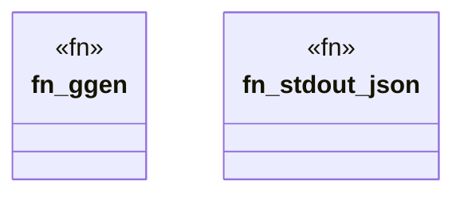

# `crates/ggen-cli/tests/proof_init_test.rs`

Source SHA-256: `2eb13a23e7872860a7eab47ce197f34d026396a4b5eb71cc65856ba2b6c77c34`

## Dependencies

- `assert_cmd::Command`
- `predicates::prelude::*`
- `serde_json::Value`
- `std::fs`
- `std::path::Path`
- `tempfile::TempDir`

## Standing

- Structural parse: `ALIVE`
- Runtime behavior: `UNKNOWN`
