# `crates/ggen-cli/tests/proof_pack_test.rs`

Source SHA-256: `c1808159f1d3fc3f46d6a0a42af347226759788c7bac889ce49b73315a159c42`

```mermaid
classDiagram
    class fn_ggen {
      <<fn>>
    }
    class struct_World {
      <<struct>>
      +"home: TempDir"
      +"project: TempDir"
      +"registry: TempDir"
    }
    class fn_test_add_writes_lockfile_with_digest_and_emits_signed_receipt {
      <<fn>>
    }
    class fn_test_add_nonexistent_pack_does_not_fake_success_or_emit_receipt {
      <<fn>>
    }
    class fn_test_list_reports_packs_present_in_real_registry {
      <<fn>>
    }
    class fn_test_list_empty_registry_reports_no_packs {
      <<fn>>
    }
    class fn_test_show_reflects_real_pack_metadata {
      <<fn>>
    }
    class fn_test_show_nonexistent_pack_exits_nonzero {
      <<fn>>
    }
    class fn_test_remove_mutates_real_lockfile {
      <<fn>>
    }
    class fn_test_remove_without_lockfile_exits_nonzero {
      <<fn>>
    }
    class fn_test_remove_absent_pack_exits_nonzero_and_preserves_lockfile {
      <<fn>>
    }
    class fn_test_add_then_remove_roundtrip_on_real_lockfile {
      <<fn>>
    }
    note "World"
```

## Dependencies

- `assert_cmd::Command`
- `predicates::prelude::*`
- `serde_json::Value`
- `std::fs`
- `std::path::{Path, PathBuf}`
- `tempfile::TempDir`

## Standing

- Structural parse: `ALIVE`
- Runtime behavior: `UNKNOWN`
