# `crates/ggen-cli/tests/proof_packs_test.rs`

Source SHA-256: `a0c95bf42a5e91582d75c0fe63954736a934b7aee88c6feb2d0a3900d22ada63`

```mermaid
classDiagram
    class fn_ggen {
      <<fn>>
    }
    class struct_World {
      <<struct>>
      +"project: TempDir"
      +"registry: TempDir"
    }
    class fn_stdout_json {
      <<fn>>
    }
    class fn_install_resolvable_pack_reports_installed_and_writes_lockfile {
      <<fn>>
    }
    class fn_install_unresolvable_pack_reports_declared_at_zero_version {
      <<fn>>
    }
    class fn_install_emits_receipt_under_project {
      <<fn>>
    }
    class fn_list_empty_project_reports_zero {
      <<fn>>
    }
    class fn_list_after_install_reports_the_pack {
      <<fn>>
    }
    class fn_validate_valid_pack_is_valid {
      <<fn>>
    }
    class fn_validate_unresolvable_pack_is_invalid {
      <<fn>>
    }
    class fn_show_found_reflects_metadata {
      <<fn>>
    }
    class fn_show_missing_is_graceful_not_found {
      <<fn>>
    }
    class fn_install_empty_pack_id_errors {
      <<fn>>
    }
    note "World"
```

## Dependencies

- `assert_cmd::Command`
- `serde_json::Value`
- `std::fs`
- `std::path::{Path, PathBuf}`
- `tempfile::TempDir`

## Standing

- Structural parse: `ALIVE`
- Runtime behavior: `UNKNOWN`
