# `crates/ggen-cli/tests/proof_policy_doctor_utils_test.rs`

Source SHA-256: `659b1236dc1e66638dfed51035cb73336be747fbaec8dd7b8ed550061f8ab6c6`

```mermaid
classDiagram
    class fn_ggen {
      <<fn>>
    }
    class fn_write_empty_lockfile {
      <<fn>>
    }
    class fn_proof_policy_list_enumerates_builtin_profiles {
      <<fn>>
    }
    class fn_proof_policy_show_resolves_real_profile {
      <<fn>>
    }
    class fn_proof_policy_show_unknown_profile_fails_closed {
      <<fn>>
    }
    class fn_proof_policy_validate_fails_without_lockfile {
      <<fn>>
    }
    class fn_proof_policy_validate_runs_enforcement_with_real_lockfile {
      <<fn>>
    }
    class fn_proof_policy_check_fails_without_lockfile {
      <<fn>>
    }
    class fn_proof_policy_check_runs_enterprise_strict_with_real_lockfile {
      <<fn>>
    }
    class fn_policy_check_reaches_policy_engine {
      <<fn>>
    }
    class fn_write_mixed_valid_and_malformed_lockfile {
      <<fn>>
    }
    class fn_policy_check_does_not_panic {
      <<fn>>
    }
    class fn_proof_utils_env_get_reads_real_environment {
      <<fn>>
    }
    class fn_proof_utils_env_list_collects_ggen_vars {
      <<fn>>
    }
    class fn_proof_utils_env_set_parses_key_value {
      <<fn>>
    }
```

## Dependencies

- `assert_cmd::Command`
- `predicates::prelude::*`
- `std::fs`
- `tempfile::TempDir`

## Standing

- Structural parse: `ALIVE`
- Runtime behavior: `UNKNOWN`
