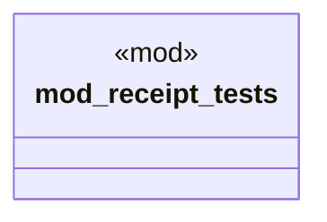

# `crates/ggen-cli/tests/receipt_generation_test.rs`

Source SHA-256: `e8ae7d8318d9c6ec328e8a15fd54c39cf97d567dad2ddf07af075c7a2dcee321`

## Dependencies

- `std::path::PathBuf`

## Standing

- Structural parse: `ALIVE`
- Runtime behavior: `UNKNOWN`
