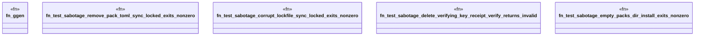

# `crates/ggen-cli/tests/sabotage_tests.rs`

Source SHA-256: `82eac0728a99235996a838152c8e0f25cf8594854c35ec4fec43dca5c7c58179`

## Dependencies

- `assert_cmd::Command`
- `predicates::prelude::*`
- `std::fs`
- `tempfile::TempDir`

## Standing

- Structural parse: `ALIVE`
- Runtime behavior: `UNKNOWN`
