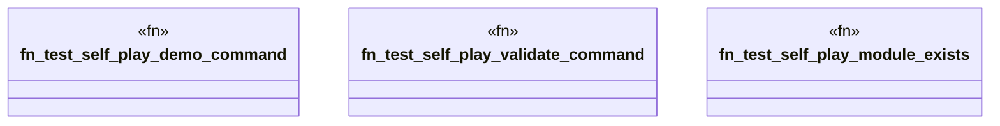

# `crates/ggen-cli/tests/self_play_smoke_test.rs`

Source SHA-256: `3be830bbd83949dd902a522c161724fb1af399bc867634e77f33bfb7312dbdca`

## Dependencies

- `std::path::PathBuf`

## Standing

- Structural parse: `ALIVE`
- Runtime behavior: `UNKNOWN`
