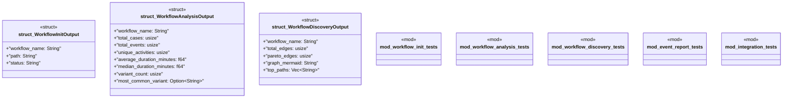

# `crates/ggen-cli/tests/workflow_command_test.rs`

Source SHA-256: `d6bd808a110668604ef981e7166c103044cc526fe44106dbdbe5808d9bfb9d14`

## Dependencies

- `serde_json`
- `std::path::PathBuf`
- `super::*`

## Standing

- Structural parse: `ALIVE`
- Runtime behavior: `UNKNOWN`
