# `crates/ggen-cli/tests/yawl_watch_test.rs`

Source SHA-256: `f89b90af0af1381ebf58b7cf80bd81a3abc0cc3ad0bfa4603b9ab0a0eece454e`

```mermaid
classDiagram
    class struct_WatchOutput {
      <<struct>>
      +"status: String"
      +"changes_detected: usize"
      +"regenerations: usize"
      +"duration_ms: u64"
      +"last_change: Option~String~"
      +"error: Option~String~"
    }
    class struct_GenerateOutput {
      <<struct>>
      +"status: String"
      +"ontology_file: String"
      +"output_dir: String"
      +"files_generated: usize"
      +"generated_files: Vec~String~"
      +"tasks_extracted: usize"
      +"flows_extracted: usize"
      +"duration_ms: u64"
      +"error: Option~String~"
      +"warning: Option~String~"
    }
    class fn_create_test_ontology {
      <<fn>>
    }
    class fn_create_output_dir {
      <<fn>>
    }
    class mod_watch_startup_tests {
      <<mod>>
    }
    class mod_debouncing_tests {
      <<mod>>
    }
    class mod_regeneration_tests {
      <<mod>>
    }
    class mod_shutdown_tests {
      <<mod>>
    }
    class mod_output_structure_tests {
      <<mod>>
    }
    class fn_simulate_watch_validation {
      <<fn>>
    }
    class fn_simulate_watch_startup {
      <<fn>>
    }
    class fn_simulate_watch_with_debounce {
      <<fn>>
    }
    class fn_simulate_generation {
      <<fn>>
    }
    class fn_simulate_change_detection {
      <<fn>>
    }
    class fn_simulate_watch_shutdown {
      <<fn>>
    }
    class fn_simulate_watch_shutdown_with_stats {
      <<fn>>
    }
```

## Dependencies

- `std::fs`
- `std::path::PathBuf`
- `std::thread`
- `std::time::Duration`
- `super::*`
- `tempfile::TempDir`

## Standing

- Structural parse: `ALIVE`
- Runtime behavior: `UNKNOWN`
