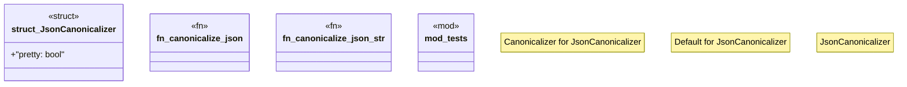

# `crates/ggen-config/src/canonical/json.rs`

Source SHA-256: `2b47050853675178fae545735718cef82e9bf0e971715e3a84694dc4e6785153`

## Dependencies

- `crate::canonical::{Canonical, CanonicalError, Canonicalizer, Result}`
- `serde::Serialize`
- `serde_json::Value`
- `serde_json::json`
- `std::collections::BTreeMap`
- `super::*`

## Standing

- Structural parse: `ALIVE`
- Runtime behavior: `UNKNOWN`
