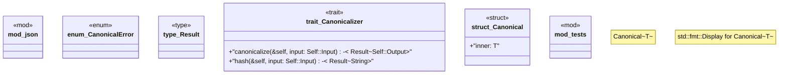

# `crates/ggen-config/src/canonical/mod.rs`

Source SHA-256: `7c8811a93a4950fdc59ee4b74469ac2e2bc63191386cc2f4e6d03c6a1b32ca5a`

## Dependencies

- `crate::canonical::json::JsonCanonicalizer`
- `super::*`

## Standing

- Structural parse: `ALIVE`
- Runtime behavior: `UNKNOWN`
