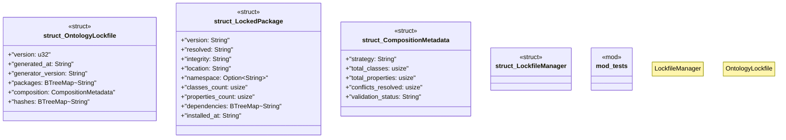

# `crates/ggen-config/src/config/lock_manager.rs`

Source SHA-256: `db348c4711651e3e52b1a8015e3dc03791da461d0faffb566452cf877f1c7c62`

## Dependencies

- `crate::config_lib::error::Result`
- `serde::{Deserialize, Serialize}`
- `std::collections::BTreeMap`
- `std::path::Path`
- `super::*`

## Standing

- Structural parse: `ALIVE`
- Runtime behavior: `UNKNOWN`
