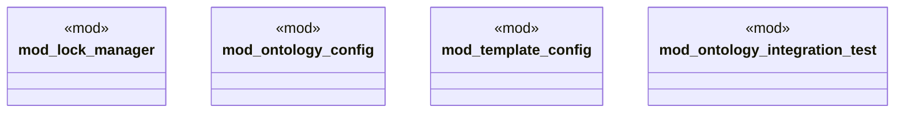

# `crates/ggen-config/src/config/mod.rs`

Source SHA-256: `0e699c938c26e9fe882a312bddf7072196b7f3008a686b520d14c6b65791fe16`

## Dependencies

- `lock_manager::{CompositionMetadata, LockedPackage, LockfileManager, OntologyLockfile}`
- `ontology_config::{ CompositionStrategy, ConflictResolution, GenerationHooks, LockConfig, OntologyConfig, OntologyPackRef, TargetConfig, }`
- `template_config::{GenerationOptions, MarketplaceSettings, TemplateConfig}`

## Standing

- Structural parse: `ALIVE`
- Runtime behavior: `UNKNOWN`
