# `crates/ggen-config/src/config/ontology_config.rs`

Source SHA-256: `f39fdac9c2ca89dc191c75c6cdeb0534c5e9035bc79f13004520e646ccbaf309`

```mermaid
classDiagram
    class struct_OntologyConfig {
      <<struct>>
      +"packs: Vec~OntologyPackRef~"
      +"composition: CompositionStrategy"
      +"targets: BTreeMap~String"
      +"features: HashMap~String"
      +"lock: LockConfig"
    }
    class struct_OntologyPackRef {
      <<struct>>
      +"name: String"
      +"version: String"
      +"namespace: Option~String~"
      +"classes: Option~Vec~String~~"
      +"properties: Option~Vec~String~~"
      +"source: Option~String~"
    }
    class enum_CompositionStrategy {
      <<enum>>
    }
    class enum_ConflictResolution {
      <<enum>>
    }
    class struct_TargetConfig {
      <<struct>>
      +"language: String"
      +"output_dir: PathBuf"
      +"features: Vec~String~"
      +"template_path: Option~PathBuf~"
      +"hooks: Option~GenerationHooks~"
    }
    class struct_GenerationHooks {
      <<struct>>
      +"pre_generate: Option~String~"
      +"post_generate: Option~String~"
      +"validate: Option~String~"
    }
    class struct_LockConfig {
      <<struct>>
      +"file: PathBuf"
      +"auto_update: bool"
      +"enforce: bool"
    }
    class mod_tests {
      <<mod>>
    }
    note "Default for LockConfig"
    note "Default for OntologyConfig"
    note "OntologyConfig"
    note "star_toml::Validate for GenerationHooks"
    note "star_toml::Validate for LockConfig"
    note "star_toml::Validate for OntologyConfig"
    note "star_toml::Validate for OntologyPackRef"
    note "star_toml::Validate for TargetConfig"
```

## Dependencies

- `crate::config_lib::error::Result`
- `serde::{Deserialize, Serialize}`
- `star_toml::Validate`
- `std::collections::{BTreeMap, HashMap}`
- `std::path::PathBuf`
- `super::*`

## Standing

- Structural parse: `ALIVE`
- Runtime behavior: `UNKNOWN`
