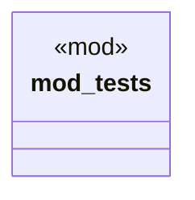

# `crates/ggen-config/src/config/ontology_integration_test.rs`

Source SHA-256: `9a3c1f631c2a83f3fce4b112dcb1448c484f4dbf5f80196baa9b54ca03f8a423`

## Dependencies

- `crate::config::{ CompositionMetadata, CompositionStrategy, LockedPackage, LockfileManager, OntologyConfig, OntologyPackRef, TargetConfig, }`
- `std::collections::BTreeMap`
- `std::path::PathBuf`

## Standing

- Structural parse: `ALIVE`
- Runtime behavior: `UNKNOWN`
