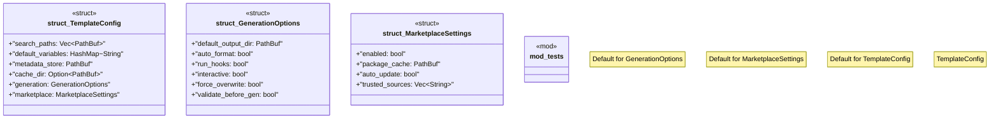

# `crates/ggen-config/src/config/template_config.rs`

Source SHA-256: `8cd70642c53d5867bb61c4d2070b74be59c0e2935c18c33728a638ed6c78ce6b`

## Dependencies

- `serde::{Deserialize, Serialize}`
- `std::collections::HashMap`
- `std::path::PathBuf`
- `super::*`

## Standing

- Structural parse: `ALIVE`
- Runtime behavior: `UNKNOWN`
