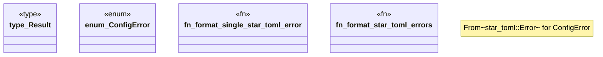

# `crates/ggen-config/src/config_lib/error.rs`

Source SHA-256: `4c22c55f886af1e5c40ad1981ea3eae031e52100bda6c98987663f470f23b78a`

## Dependencies

- `std::path::PathBuf`

## Standing

- Structural parse: `ALIVE`
- Runtime behavior: `UNKNOWN`
