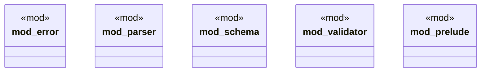

# `crates/ggen-config/src/config_lib/mod.rs`

Source SHA-256: `3b692bc285f9bce2a2d0737d277b491dbba4cc0e24bdb63cb4420e7be993e2c5`

## Dependencies

- `error::{ConfigError, Result}`
- `parser::ConfigLoader`
- `schema::*`
- `super::{ A2AConfig, A2AMessagingConfig, A2AOrchestrationConfig, A2ARetryConfig, A2ATransportConfig, AiConfig, ConfigError, ConfigLoader, ConfigValidator, GgenConfig, McpConfig, McpDiscoveryConfig, McpTlsConfig, McpToolsConfig, McpTransportConfig, McpZaiConfig, ProjectConfig, Result, TemplatesConfig, }`
- `validator::ConfigValidator`

## Standing

- Structural parse: `ALIVE`
- Runtime behavior: `UNKNOWN`
