# `crates/ggen-config/src/config_lib/parser.rs`

Source SHA-256: `00e5575f349664d7574e8b97d078d2457e31d953b4390e996f742339510deeee`

```mermaid
classDiagram
    class struct_ConfigLoader {
      <<struct>>
      +"path: PathBuf"
    }
    class fn_apply_env_overrides {
      <<fn>>
    }
    class fn_apply_single_override {
      <<fn>>
    }
    class fn_update_ai_field {
      <<fn>>
    }
    class fn_update_security_field {
      <<fn>>
    }
    class fn_update_logging_field {
      <<fn>>
    }
    class fn_update_performance_field {
      <<fn>>
    }
    class fn_update_mcp_field {
      <<fn>>
    }
    class fn_update_a2a_field {
      <<fn>>
    }
    class fn_default_mcp_enabled {
      <<fn>>
    }
    class fn_default_a2a_enabled {
      <<fn>>
    }
    class mod_tests {
      <<mod>>
    }
    note "ConfigLoader"
```

## Dependencies

- `crate::config_lib::{ConfigError, GgenConfig, Result}`
- `std::path::{Path, PathBuf}`
- `super::*`

## Standing

- Structural parse: `ALIVE`
- Runtime behavior: `UNKNOWN`
